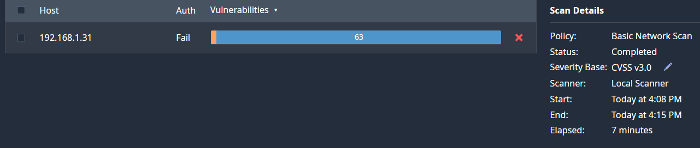

# Vulnerability Assessment Report

## Objective
Conduct a vulnerability assessment on a Windows system using Nessus Essentials to identify security weaknesses and evaluate risk exposure.

### Scan Details
- Target: 192.168.1.50
- Scan Type: Basic Network Scan
- Authentication: Unauthenticated (external perspective)
- Scanner: Nessus Essentials

### Severity Overview
The scan identified multiple vulnerabilities across varying severity levels, including medium-risk findings related to SSL certificate trust configuration.

### Key Finding: SSL Certificate Cannot Be Trusted
One notable medium-severity vulnerability identified was an untrusted SSL certificate configuration. This condition may allow attackers to perform man-in-the-middle attacks if certificate validation is not properly enforced.

### Risk Assessment
- Severity: Medium
- CVSS v3 Score: 6.5
- Risk Type: Certificate trust chain validation issue

### Remediation Strategy
- Replace or regenerate SSL certificates signed by a trusted Certificate Authority.
- Ensure proper certificate chain configuration.
- Validate certificate expiration and signature integrity.

### Conclusion
The assessment demonstrates how unauthenticated scans can identify externally visible security misconfigurations and highlights the importance of proper certificate management in reducing system exposure.

## Attempted Authenticated Scan

### An authenticated vulnerability scan was attempted using Nessus Essentials by providing Windows credentials to the scanner. The goal of this scan was to simulate an internal vulnerability assessment where the scanner has access to system-level information.

### Target Host:
192.168.1.31

### During the scan, Nessus attempted to authenticate to the host but returned an "Auth: Fail" result. This indicates the scanner was unable to successfully log in using the provided credentials.

### Possible reasons for authentication failure include:
- Incorrect credential formatting
- Windows firewall restrictions
- Required Windows services such as Remote Registry not enabled
- Local security policies restricting remote administrative access

### Despite the authentication failure, the scan demonstrates the difference between unauthenticated and authenticated vulnerability scanning and highlights the configuration requirements necessary for deeper vulnerability analysis.

